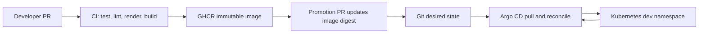

# Chatterbox

A small real-time chat service, delivered through a production-shaped pipeline:
GitHub Actions, GHCR, Helm, Kubernetes, and Argo CD. This directory is the
project root.

The goal is not merely "deploy an app." It is a delivery model you can explain
and demonstrate end to end:

- CI proves a change is buildable and safe enough to publish.
- CI publishes an immutable artifact.
- Promotion changes Git's declared environment state; it does not run
  `kubectl` against the cluster.
- Argo CD pulls the desired state from Git and reconciles the cluster.
- Drift, rollout health, provenance, rollback, and developer feedback are
  observable.

## Target flow



The important boundary is between **artifact production** and **deployment**.
GitHub Actions receives registry and Git permissions, but no Kubernetes
credentials. Argo CD receives read access to Git and controlled access to the
cluster, but it does not build application images.

## What is already scaffolded

- `cmd/server/`: a tiny Go HTTP service with health, readiness, and version
  endpoints, the seed the chat backend grows from.
- `Dockerfile`: a multi-stage, non-root, minimal container image.
- `charts/chatterbox/`: a working Helm chart with probes, resources, security
  context, and values validation.
- `gitops/environments/dev/values.yaml`: the desired dev release state.
- `.github/workflows/`: valid but deliberately unfinished CI and release
  workflows.
- `gitops/argocd/application.yaml`: a declarative Argo CD `Application`.
- `scripts/check.sh`: a harness that runs all checks and reports every unfinished
  milestone.

## Start here

Your local tools are installed. Docker Desktop is not currently running, so
start it before the container or kind stages.

```bash
cd /Users/gateswang/Programming/repos/chatterbox

make test
make helm-lint
make helm-template
make check
```

`make check` is expected to fail initially because the CI and release workflows
still contain `TODO` markers. The Argo CD repository URL and dev image repository
are already filled in. The harness still executes every available check and
prints one result per check.

## Milestone 1: PR continuous integration

Implement `.github/workflows/ci.yaml`.

Requirements:

1. Trigger on pull requests and pushes to `main`.
2. Grant only `contents: read`.
3. Check out the repository and install Go using `go.mod`.
4. Run `go test ./...` and `go vet ./...`.
5. Run `helm lint` with the dev values file.
6. Render the chart with `helm template` and fail on invalid output.
7. Build the Dockerfile without publishing it.
8. Use job timeouts and cancel stale runs for the same branch.

Definition of done: a broken Go test, invalid Helm value, or failed image build
blocks the PR, and the workflow holds no package or cluster write permission.

## Milestone 2: Source and artifact locations

This folder is already a standalone Git repository, and both desired-state
placeholders are filled in with the `chatterbox` identity:

- `spec.source.repoURL` in `gitops/argocd/application.yaml`;
- `image.repository` in `gitops/environments/dev/values.yaml`.

Use a public repository and public GHCR package for the first local cluster
iteration. Private Git and image authentication are a later hardening exercise.
Create the remote and push:

```bash
gh repo create chatterbox --public --source=. --remote=origin --push
```

## Milestone 3: Immutable image publication

Implement the build portion of `.github/workflows/release.yaml`.

Requirements:

1. Run only after changes reach `main` and CI has succeeded.
2. Grant `contents: write` only if the same workflow will create the GitOps
   change; grant `packages: write` for GHCR.
3. Authenticate to GHCR with `GITHUB_TOKEN`.
4. Build once and publish an image tagged for the source commit.
5. Capture the registry-produced `sha256` digest.
6. Add OCI source/revision/version labels and retain build provenance.
7. Pin third-party actions to immutable commit SHAs before treating the pipeline
   as production-ready.

Definition of done: the image is addressable by digest, traceable to one Git
commit and workflow run, and reproducible without rebuilding during promotion.

## Milestone 4: GitOps promotion

Complete the promotion portion of `.github/workflows/release.yaml`.

Requirements:

1. Update only the `image.repository` and `image.digest` fields in the dev
   values file.
2. Propose the desired-state change through a pull request. Direct-to-main may
   be used temporarily for the first demo, but document why it is weaker.
3. Include the source commit and image digest in the commit or PR description.
4. Make retries idempotent: rerunning the same release must not create a
   different desired state.
5. Prevent the GitOps-only commit from recursively publishing another image.

Definition of done: CI has no kubeconfig, Git history records the promotion, and
reverting one values-file commit expresses rollback to the previous digest.

## Milestone 5: Local Argo CD reconciliation

After Docker Desktop is running and the repository is remotely accessible:

```bash
kind create cluster --name chatterbox
kubectl create namespace argocd
kubectl apply -n argocd --server-side --force-conflicts \
  -f https://raw.githubusercontent.com/argoproj/argo-cd/stable/manifests/install.yaml
kubectl wait --for=condition=Available deployment/argocd-server \
  -n argocd --timeout=180s
kubectl apply -f gitops/argocd/application.yaml
kubectl get applications -n argocd
kubectl get all -n chatterbox-dev
```

Then prove the GitOps properties:

1. Change the replica count in Git and observe Argo CD reconcile it.
2. Manually edit the live Deployment and observe self-healing restore Git state.
3. Remove a managed resource from the chart and observe pruning.
4. Revert the image-digest promotion and observe rollback.
5. Stop the application process or delete a pod and distinguish Kubernetes
   self-healing from Argo CD drift reconciliation.

## Milestone 6: Production hardening

Add these only after the local loop works:

- protected environments and required promotion reviews;
- separate application and environment repositories;
- signed images, SBOM, vulnerability policy, and artifact attestations;
- private repository/registry credentials or workload identity;
- Argo CD `AppProject`, least privilege, SSO, and audit policy;
- progressive delivery and automated rollback based on service-level metrics;
- secret management without plaintext Git secrets;
- policy-as-code, network policy, resource quotas, and admission controls;
- deployment SLOs, queue/lead time, change-failure rate, and recovery metrics;
- EKS and Argo CD bootstrap through Terraform.

Avoid starting with EKS. The local loop proves the control boundaries cheaply;
moving an unclear design to AWS only adds cost and slower feedback.

## Design decisions worth being able to explain

- Why CI pushes an artifact and changes Git, but never pushes directly to the
  cluster.
- How an immutable digest differs from a mutable image tag.
- What happens when image publication succeeds but the GitOps PR fails.
- What happens when Git changes but Argo CD or the cluster is unavailable.
- How retries stay idempotent across build, promotion, and reconciliation.
- How rollback, audit, authorization, secrets, and multi-environment promotion
  evolve beyond the demo.
- Which metrics represent developer experience versus platform health.

Record your decisions and failure experiments in
[`docs/engineering-notes.md`](docs/engineering-notes.md); those notes become the
project story you can present during system design.
